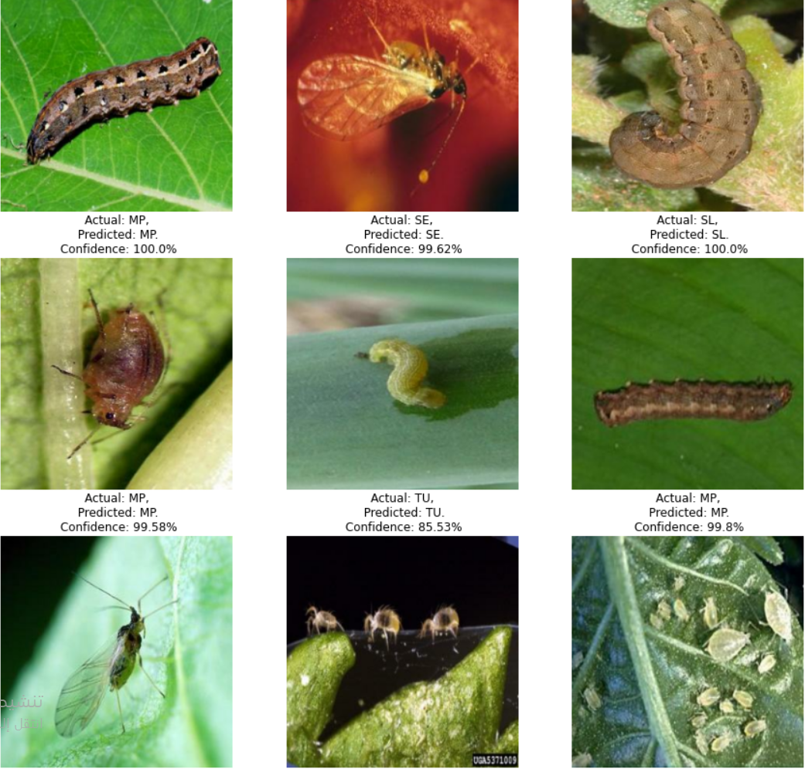

# Application of agricultural pest classification
DEEP learning App using CNN Algorithm to Classify Insect Pests Images  
#### Classification of images of agricultural insect pests targeting strategic crops with 12 different types of insects
[Visit APP ](https://deeplearningagriculturalpests-abdo-rawak.streamlit.app/)

## UI 

## Steps:
- Upload an image of an insect pest to classify it
- Wait until the result appears
- The name of the pest and methods to combat it will appear

### CNN (Convolutional Neural Network Architecture)
A CNN typically has three layers: a convolutional layer, a pooling layer, and a fully connected layer.
 - Convolution Layer

- Pooling Layer
#### The pooling layer replaces the output of the network at certain locations by deriving a summary statistic of the nearby outputs.

- Fully Connected Layer
#### Neurons in this layer have full connectivity with all neurons in the preceding and succeeding layer as seen in regular FCNN. This is why it can be computed as usual by a matrix multiplication followed by a bias effect.

## packes & framework & algo 
- CNN
- Python =3.9
- jupyter notebook =defalut
- numpy
- pandas
- matplotlib
- streamlit 
- tensorflow 
- keras
# streamlit server 
## CN.PY file 

### read the nootebook, some of result :
[jupyter notebook](https://github.com/abduallheid/deep_learning_pest_tomato_CNN/blob/main/tomato.ipynb)
 

   

## References
- ( Deep Learning by Ian Goodfellow, Yoshua Bengio and Aaron Courville published by MIT Press, 2016)
